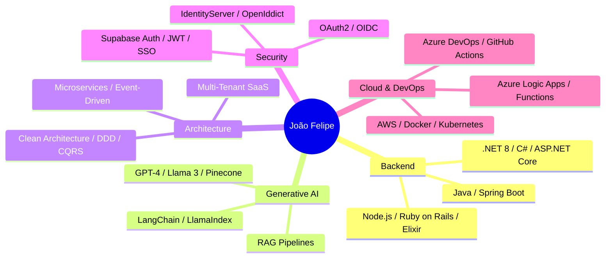
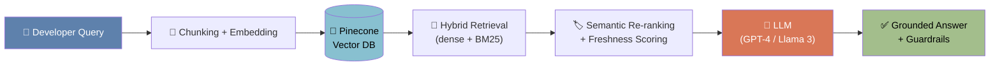

<div align="center">


[](https://www.linkedin.com/in/joaopereiradev)
[](mailto:joaofel98@gmail.com)
[](#)


</div>

<br/>

## `whoami`

```bash
$ whoami --verbose

>> João Felipe Furtado Pereira
>> role........... Senior Software Engineer (.NET 8+ | Java | Azure | Generative AI)
>> experience..... 7+ years, full development lifecycle
>> based_in....... Manaus, Amazonas, Brazil 🇧🇷
>> languages...... English (fluent) · French (advanced) · Portuguese (native)
>> currently...... Tech Reference @ oHubDev — multi-tenant SaaS (Workforce Mgmt + ERP)
>> past_impact.... Shopify (AI Copilot/RAG) · Samsung (+25% operational efficiency)
>> specialty...... Clean Architecture, distributed systems, RAG pipelines, OAuth2/OIDC
>> mission........ international relocation -> global, high-impact engineering teams
```

I'm a Senior Software Engineer with **7+ years** of experience spanning the full development
lifecycle — from architecting **multi-tenant SaaS platforms on Azure** to shipping
**production Generative AI systems** at companies like **Shopify** and **Samsung**.
I care about systems that are scalable, resilient, secure, and simple to reason about,
even as they grow in complexity.

<div align="center">



</div>

---

## 🧰 Tech Arsenal

<div align="center">

<br/><br/>

</div>

<br/>

<details open>
<summary><b>🏗️ Backend & Platforms</b></summary>
<br/>


</details>

<details>
<summary><b>🤖 AI & Data Science</b></summary>
<br/>


</details>

<details>
<summary><b>🔐 Architecture & Security</b></summary>
<br/>


</details>

<details>
<summary><b>☁️ Cloud & DevOps</b></summary>
<br/>


</details>

<details>
<summary><b>🗄️ Databases</b></summary>
<br/>


-000000?style=flat-square)


</details>

<details>
<summary><b>🎨 Frontend</b></summary>
<br/>


-4285F4?style=flat-square&logo=googlechrome&logoColor=white)

</details>

---

## 📐 Signature Architecture — RAG Pipeline (Shopify Internal Copilot)

<div align="center">



</div>

Centralized knowledge from thousands of internal repositories into a single Generative AI
assistant — cutting new-engineer ramp-up time through hybrid retrieval, semantic re-ranking,
prompt-injection guardrails, structured-output validation and offline evals.

---

## 💼 Professional Journey

<details open>
<summary><b>🟢 oHubDev — Senior .NET Software Engineer / Tech Reference</b> <sub>· Dec 2025 – Present</sub></summary>
<br/>

Technical reference across **two multi-tenant SaaS products**: a workforce-management /
timekeeping platform and a full-scope **ERP** (financials, procurement, billing, partner
integrators).

- 🏛️ Defined standards for **Clean Architecture**, layered separation (Controller → Service → Repository), DI by convention, and async-by-default patterns in **.NET 8**.
- ⚙️ Designed ASP.NET Core 8 APIs with **EF Core 8 + Npgsql (PostgreSQL)**, FluentValidation, generic `Repository<T>`, ClosedXML exports, custom `HttpLoggingMiddleware`, standardized `ApiResponse` contract.
- 🧩 Built a **Chrome Extension (Manifest V3)** — React 17 + TypeScript 5.5, custom Webpack 5 build, Tailwind, Zustand, React Query v4, i18next — integrated with the Azure DevOps SDK 4.x (10s GET cache, in-flight dedup, automatic JWT refresh).
- 🔄 Designed event-driven workflows on **Azure Logic Apps** and operated multiple **Azure Functions** for domain events, BI ETL jobs and partner integrators.
- 🔐 Implemented **IdentityServer / OpenIddict (OAuth2/OIDC)** and **Supabase Auth** for secure SSO with role-based policies (Admin / Manager / Contributor).
- ☁️ Daily use of Logic Apps, Functions, Service Bus, Blob/Table/Queue Storage, Key Vault, App Insights — CI/CD via Azure DevOps Pipelines → private Container Registry → **Coolify**.
- 🧑‍🏫 Mentored mid-level engineers on Clean Architecture, async/await correctness, nullability and observability.

`.NET 8` `EF Core` `PostgreSQL` `Azure Logic Apps` `Azure Functions` `OpenIddict` `Supabase` `React` `TypeScript` `Chrome Ext. MV3`

</details>

<details>
<summary><b>🟢 Shopify — Senior Software Engineer, AI & Productivity</b> <sub>· Jan 2025 – Nov 2025</sub></summary>
<br/>

Dual role: built the **"Shopify Internal Copilot"** while providing platform-wide production
sustainment (incidents, hotfixes, performance regressions, reliability).

- 🧠 Engineered a Generative AI assistant centralizing knowledge from thousands of internal repos, deeply integrated with the monorepo and code-review pipelines.
- 🔎 Designed a **RAG pipeline** with **LangChain, LlamaIndex, Pinecone** — chunking strategies, hybrid retrieval (dense + BM25), semantic re-ranking, freshness scoring.
- 🤖 Integrated **GPT-4** and **Llama 3** via the GitHub GraphQL API — tool-use agents for code search, PR triage, release-notes generation with prompt-injection guardrails and offline evals.
- 🏭 Day-to-day on Shopify's **Ruby on Rails** monolith with **Sorbet**, MySQL + Vitess (sharded storage), Memcached, Redis, **Kafka**, GraphQL, React/TypeScript, **Kubernetes on GCP**.
- 📊 Instrumented LLM latency, token usage and answer-quality metrics on **Datadog/Splunk**, optimizing cost-per-query via caching, model routing and prompt compression.
- 🚀 Buildkite pipelines, ShipIt deploys, feature-flag systems, pod-based ownership, on-call rotations.

`Ruby on Rails` `Sorbet` `Python` `GPT-4` `Llama 3` `LangChain` `Pinecone` `Kafka` `Kubernetes` `GCP` `Datadog`

</details>

<details>
<summary><b>🟣 Deep Fork Automation — AI & Machine Learning Engineer</b> <sub>· Jan 2024 – Dec 2024</sub></summary>
<br/>

Built AI products for the **oil & gas industry** — turning raw geological data into
model-driven, multi-million-dollar drilling recommendations.

- 🌍 Ingested seismic surveys, well logs (LAS) and IoT rig telemetry into a **Databricks (Delta Lake)** lakehouse via **Apache Spark** pipelines processing terabytes of geophysical data.
- 🧠 Trained **3D CNNs / 3D-UNets** for volumetric seismic interpretation and **LSTM/Transformer** sequence models for production-rate forecasting.
- 🎯 Implemented **Bayesian Neural Networks**, Monte Carlo dropout and ensembles for calibrated uncertainty — because a wrong call costs tens of millions.
- 🗺️ Built geospatial tooling (NumPy, SciPy, scikit-learn, GDAL, Rasterio, PyVista) turning model output into 3D probability volumes.
- ⚙️ Ran MLOps with **MLflow**, multi-GPU training (CUDA, mixed precision), shipped inference as containerized **FastAPI** services with autoscaling; reproducibility via **DVC**.

`Python` `TensorFlow` `PyTorch` `Apache Spark` `Databricks` `MLflow` `DVC` `FastAPI` `CUDA` `AWS SageMaker`

</details>

<details>
<summary><b>🔵 Samsung Electronics — Tech Lead / Senior Java Software Engineer</b> <sub>· Jun 2023 – Dec 2023</sub></summary>
<br/>

Tech Lead for Samsung's financial & procurement software suite supporting factory operations
in Manaus — owned the backend platform end to end.

- 🏗️ Designed a microservices ecosystem in **Java 11/17 + Spring Boot**, Spring Security, Spring Data JPA, Hibernate, OpenAPI/Swagger, MapStruct, Lombok.
- 🔄 Async processing via Spring Cloud, message queues, **Quartz** scheduled jobs; progressively absorbed a legacy Rails slice.
- 📈 Automated purchase-order workflows, delivering a **+25% increase in operational efficiency** and shortening PO cycle time.
- 👥 Led a full-stack squad: sprint planning, technical decisions, code reviews, hiring, stakeholder alignment (Manaus ↔ HQ Suwon).
- ✅ CI on **Jenkins**, JUnit 5 + Mockito, Testcontainers, ELK logging, Prometheus/Grafana metrics.

`Java 11/17` `Spring Boot` `Spring Security` `Hibernate` `Quartz` `Vue.js/Quasar` `PostgreSQL` `Jenkins` `Grafana`

</details>

<details>
<summary><b>🟠 Velotax — Senior Full-Stack Software Engineer</b> <sub>· Feb 2022 – May 2023</sub></summary>
<br/>

Joined during the pivot from a pure income-tax product into a full **fintech** (brokerage,
B3 custody, investments, payments, credit).

- 🏦 Engineered backend services in **Java (Spring Boot)**, **Ruby on Rails** and **Node.js**, integrated with Receita Federal (eCAC, DARFs), B3 custody and partner brokerages during peak IRPF season loads.
- 📨 Adopted **RabbitMQ** as the async backbone (exchanges, routing keys, DLQs, retries, idempotent consumers) for tax calculation, brokerage import and notifications.
- 📱 Built **React/TypeScript** web and **React Native + Kotlin** mobile — owned the income-tax declaration flow end to end (offline-first, push, deep links).
- 💳 Integrated payment gateways with idempotency keys, double-entry reconciliation and audit trails.
- 🚀 Reduced P99 latency via JVM/Rails tuning, SQL optimization and Redis caching; Docker + AWS ECS/EC2, GitHub Actions CI/CD.

`Java` `Spring Boot` `Ruby on Rails` `Node.js` `RabbitMQ` `React Native` `Kotlin` `AWS ECS`

</details>

<details>
<summary><b>🟣 BrasilCenter (Claro S.A.) — Senior Java Engineer / CX Consultant</b> <sub>· Jan 2021 – Jan 2022</sub></summary>
<br/>

Backend services orchestrating call routing, IVR flows and customer-data integrations for
one of Brazil's largest telco operations.

- 📞 Maintained Java EE / Spring services (Servlets, JAX-RS, JAX-WS, EJB, Spring Boot/MVC) on WebLogic and JBoss/WildFly, exposing SOAP + REST to CTI/CRM/IVR layers.
- 🔀 Directed a **zero-downtime migration** of IVR systems to **NICE CXone**, routing millions of daily interactions.
- ⚡ Tuned Java services and **Oracle DB** (PL/SQL, indexes, execution plans, partitioning) to cut latency on business-critical routing logic.
- 🛡️ Built resilient integrations with retry policies, circuit breakers (Hystrix-style) and bulkheads to survive partial outages.
- 📊 Runbooks, Grafana dashboards, on-call rotations, RCAs; translated business needs into IVR/routing strategy and KPIs (AHT, FCR, abandonment).

`Java 8/11` `Spring` `WebLogic` `JBoss/WildFly` `Oracle DB (PL/SQL)` `NICE CXone` `SOAP/REST`

</details>

<details>
<summary><b>⚙️ Pedragon (Chevrolet) — Full-Stack Software Engineer</b> <sub>· May 2019 – Dec 2020</sub></summary>
<br/>

Digital platform supporting sales, after-sales and back-office for one of Brazil's largest
Chevrolet dealership groups.

- 🚗 Built core backend in **Java 8/11 + Spring Boot**, Spring Data JPA, Hibernate, Spring Security, backed by PostgreSQL, consumed by dealership portals, Salesforce CRM and mobile sales tools.
- ☁️ Developed tailored **Salesforce** solutions (Apex, Triggers, SOQL, Lightning Web Components) automating lead management and approval flows.
- ⚡ Implemented real-time, fault-tolerant services in **Elixir/Phoenix** (OTP supervisors, GenServers) for high-traffic sales campaigns and vehicle launches.
- 🔗 Integrated Salesforce + Java backend with internal ERPs and external automotive/OEM systems, ensuring eventual consistency.
- 🛠️ CI/CD pipelines, Dockerized environments, structured logging/monitoring, production deploys.

`Java 8/11` `Spring Boot` `Salesforce (Apex/LWC)` `Elixir/Phoenix` `PostgreSQL` `Docker`

</details>

---

## 🎓 Education & Certifications


**Pursuing:**


## 🌍 Languages

| Language | Level | |
|---|---|---|
| 🇧🇷 Portuguese | Native | `██████████` 100% |
| 🇬🇧 English | Fluent | `█████████░` 95% |
| 🇫🇷 French | Advanced | `███████░░░` 75% |
| 🇷🇺 Russian | Learning | `███░░░░░░░` 30% |

---

## 🚀 Future Aspirations

> 🌐 **International Relocation & Global Impact** — actively pursuing a move into the North American tech sector to contribute to world-class engineering teams.
> 🧠 **Leadership in AI-Driven Architecture** — consolidating my path as a Technical Lead specializing in Generative AI (RAG) and LLM orchestration across enterprise .NET and Java ecosystems.
> 📜 **Continuous Specialization** — AZ-204, AZ-400, AI-102 to complement 7+ years of hands-on experience.
> 🗣️ **Multilingual Engineering Leadership** — building professional proficiency in French and Russian to lead diverse, cross-border squads.
> 🏛️ **Architectural Excellence in SaaS** — pushing multi-tenant SaaS architecture further on availability, security and operational efficiency.

---

## 📊 GitHub Analytics

<div align="center">


</div>

<!--START_SECTION:waka-->
<!-- WakaTime / coding-activity stats can auto-render here once the workflow in
     .github/workflows/waka-readme.yml is enabled with a WAKATIME_API_KEY secret -->
<!--END_SECTION:waka-->

### 🐍 Contribution Snake

<div align="center">

</div>

<sub>Generated automatically by the workflow in <code>.github/workflows/snake.yml</code> — see setup notes below.</sub>

---

## 📈 Activity Graph

<div align="center">

</div>

---

## ☕ Philosophy

> Systems should be simple to understand,
> but powerful enough to handle complexity.

---

<div align="center">

### 🌐 Let's Connect

[](https://www.linkedin.com/in/joaopereiradev)
[](mailto:joaofel98@gmail.com)


</div>
